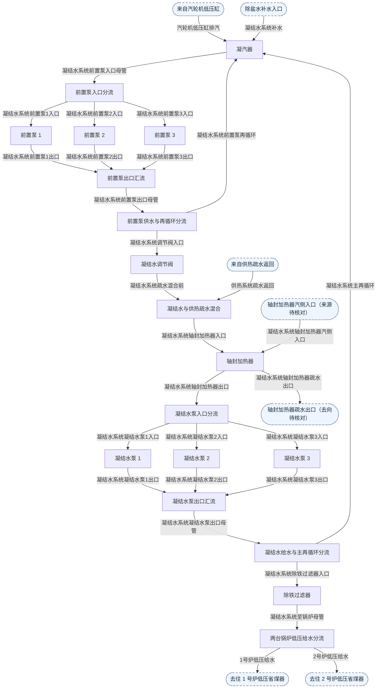

```mermaid
flowchart TB
    %% 设备节点；保留凝结水主路径、并联泵组和泵再循环；凝汽器与轴封加热器的流体侧分别表示
    condenser["凝汽器"]
    pre_pump_split["前置泵入口分流"]
    pre_pump1["前置泵 1"]
    pre_pump2["前置泵 2"]
    pre_pump3["前置泵 3"]
    pre_pump_merge["前置泵出口汇流"]
    pre_recycle_split["前置泵供水与再循环分流"]
    cond_control["凝结水调节阀"]
    heating_drain_mix["凝结水与供热疏水混合"]
    gland_heater["轴封加热器"]
    cond_pump_split["凝结水泵入口分流"]
    cond_pump1["凝结水泵 1"]
    cond_pump2["凝结水泵 2"]
    cond_pump3["凝结水泵 3"]
    cond_pump_merge["凝结水泵出口汇流"]
    cond_users_split["凝结水给水与主再循环分流"]
    iron_filter["除铁过滤器"]
    boiler_feed_split["两台锅炉低压给水分流"]

    %% 外部接口；圆角节点表示本系统的入口和出口
    cond_st_exhaust_in(["来自汽轮机低压缸"])
    cond_makeup_water_in(["除盐水补水入口"])
    cond_heating_drain_in(["来自供热疏水返回"])
    cond_gland_steam_in(["轴封加热器汽侧入口（来源待核对）"])
    cond_gland_drain_out(["轴封加热器疏水出口（去向待核对）"])
    cond_lp1_feedwater_out(["去往 1 号炉低压省煤器"])
    cond_lp2_feedwater_out(["去往 2 号炉低压省煤器"])

    %% 物质流连接；流股按设备位置和介质命名
    cond_st_exhaust_in -->|汽轮机低压缸排汽| condenser
    cond_makeup_water_in -->|凝结水系统补水| condenser
    condenser -->|凝结水系统前置泵入口母管| pre_pump_split
    pre_pump_split -->|凝结水系统前置泵1入口| pre_pump1
    pre_pump_split -->|凝结水系统前置泵2入口| pre_pump2
    pre_pump_split -->|凝结水系统前置泵3入口| pre_pump3
    pre_pump1 -->|凝结水系统前置泵1出口| pre_pump_merge
    pre_pump2 -->|凝结水系统前置泵2出口| pre_pump_merge
    pre_pump3 -->|凝结水系统前置泵3出口| pre_pump_merge
    pre_pump_merge -->|凝结水系统前置泵出口母管| pre_recycle_split
    pre_recycle_split -->|凝结水系统前置泵再循环| condenser
    pre_recycle_split -->|凝结水系统调节阀入口| cond_control
    cond_control -->|凝结水系统疏水混合前| heating_drain_mix
    cond_heating_drain_in -->|供热系统疏水返回| heating_drain_mix
    heating_drain_mix -->|凝结水系统轴封加热器入口| gland_heater
    cond_gland_steam_in -->|凝结水系统轴封加热器汽侧入口| gland_heater
    gland_heater -->|凝结水系统轴封加热器出口| cond_pump_split
    gland_heater -->|凝结水系统轴封加热器疏水出口| cond_gland_drain_out
    cond_pump_split -->|凝结水系统凝结水泵1入口| cond_pump1
    cond_pump_split -->|凝结水系统凝结水泵2入口| cond_pump2
    cond_pump_split -->|凝结水系统凝结水泵3入口| cond_pump3
    cond_pump1 -->|凝结水系统凝结水泵1出口| cond_pump_merge
    cond_pump2 -->|凝结水系统凝结水泵2出口| cond_pump_merge
    cond_pump3 -->|凝结水系统凝结水泵3出口| cond_pump_merge
    cond_pump_merge -->|凝结水系统凝结水泵出口母管| cond_users_split
    cond_users_split -->|凝结水系统主再循环| condenser
    cond_users_split -->|凝结水系统除铁过滤器入口| iron_filter
    iron_filter -->|凝结水系统至锅炉母管| boiler_feed_split
    boiler_feed_split -->|1号炉低压给水| cond_lp1_feedwater_out
    boiler_feed_split -->|2号炉低压给水| cond_lp2_feedwater_out

    classDef boundary fill:#eef5ff,stroke:#526d82,stroke-dasharray:5 5,color:#162b3b;
    class cond_cooling_water_in,cond_st_exhaust_in,cond_makeup_water_in,cond_cooling_water_out,cond_vacuum_out,cond_heating_drain_in,cond_gland_steam_in,cond_gland_drain_out,cond_lp1_feedwater_out,cond_lp2_feedwater_out boundary;
```
