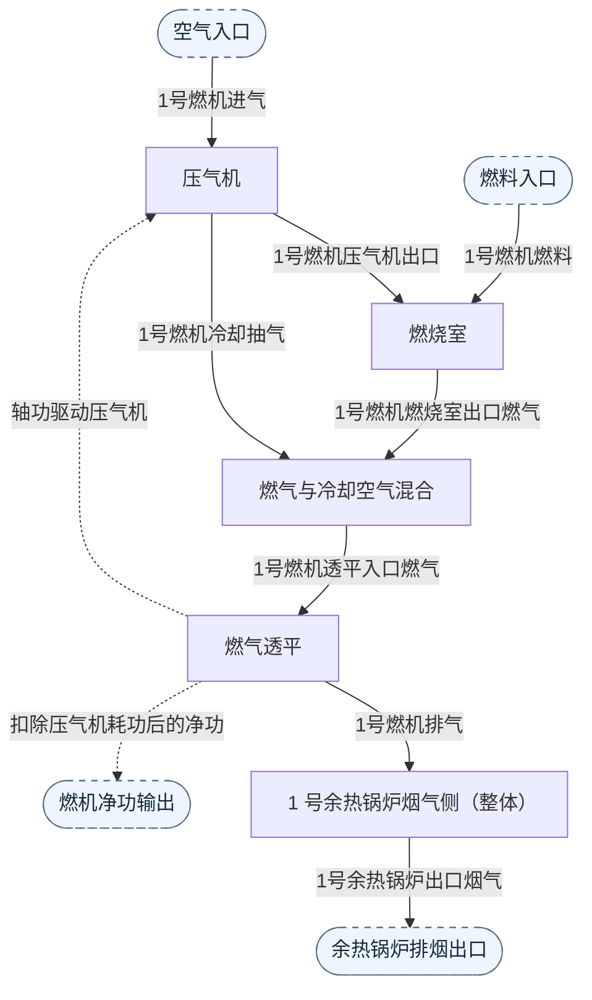

```mermaid
flowchart TB
    %% 设备与混合节点；保留燃机主路径、冷却抽气和余热锅炉整体烟气边界
    %% 混合点展开当前模型的等效冷却混合过程，未细分各级叶片冷却支路
    gt1_compressor["压气机"]
    gt1_chamber["燃烧室"]
    gt1_cooling_mix["燃气与冷却空气混合"]
    gt1_turbine["燃气透平"]
    hrsg1_gas_boundary["1 号余热锅炉烟气侧（整体）"]

    %% 外部接口；圆角节点表示本系统的入口和出口
    gt1_air_in(["空气入口"])
    gt1_fuel_in(["燃料入口"])
    gt1_flue_gas_out(["余热锅炉排烟出口"])
    gt1_net_work_out(["燃机净功输出"])

    %% 物质流连接；流股按设备位置和介质命名
    gt1_air_in -->|1号燃机进气| gt1_compressor
    gt1_compressor -->|1号燃机压气机出口| gt1_chamber
    gt1_fuel_in -->|1号燃机燃料| gt1_chamber
    gt1_chamber -->|1号燃机燃烧室出口燃气| gt1_cooling_mix
    gt1_compressor -->|1号燃机冷却抽气| gt1_cooling_mix
    gt1_cooling_mix -->|1号燃机透平入口燃气| gt1_turbine
    gt1_turbine -->|1号燃机排气| hrsg1_gas_boundary
    hrsg1_gas_boundary -->|1号余热锅炉出口烟气| gt1_flue_gas_out

    %% 轴功关系；虚线表示驱动功和系统净功
    gt1_turbine -.->|轴功驱动压气机| gt1_compressor
    gt1_turbine -.->|扣除压气机耗功后的净功| gt1_net_work_out

    classDef boundary fill:#eef5ff,stroke:#526d82,stroke-dasharray:5 5,color:#162b3b;
    class gt1_air_in,gt1_fuel_in,gt1_flue_gas_out,gt1_net_work_out boundary;
```
