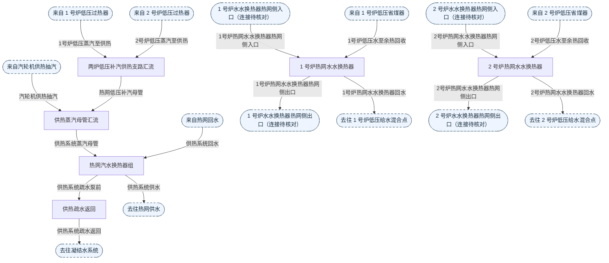

```mermaid
flowchart TB
    %% 设备节点；保留蒸汽供热、疏水返回和热网水水换热路径；换热器两侧流体分别流动
    heating_lp_steam_merge["两炉低压补汽供热支路汇流"]
    heating_steam_merge["供热蒸汽母管汇流"]
    heating_exchangers_boundary["热网汽水换热器组"]
    heating_drain_return_boundary["供热疏水返回"]
    heat_recovery1["1 号炉热网水水换热器"]
    heat_recovery2["2 号炉热网水水换热器"]

    %% 外部接口；圆角节点表示本系统的入口和出口
    heating_st_steam_in(["来自汽轮机供热抽汽"])
    heating_lp1_steam_in(["来自 1 号炉低压过热器"])
    heating_lp2_steam_in(["来自 2 号炉低压过热器"])
    heating_network_water_in(["来自热网回水"])
    heating_network_water_out(["去往热网供水"])
    heating_drain_out(["去往凝结水系统"])
    heating_recovery1_network_in(["1 号炉水水换热器热网侧入口（连接待核对）"])
    heating_recovery1_boiler_in(["来自 1 号炉低压省煤器"])
    heating_recovery1_network_out(["1 号炉水水换热器热网侧出口（连接待核对）"])
    heating_recovery1_boiler_out(["去往 1 号炉低压给水混合点"])
    heating_recovery2_network_in(["2 号炉水水换热器热网侧入口（连接待核对）"])
    heating_recovery2_boiler_in(["来自 2 号炉低压省煤器"])
    heating_recovery2_network_out(["2 号炉水水换热器热网侧出口（连接待核对）"])
    heating_recovery2_boiler_out(["去往 2 号炉低压给水混合点"])

    %% 物质流连接；流股按设备位置和介质命名
    heating_st_steam_in -->|汽轮机供热抽汽| heating_steam_merge
    heating_lp1_steam_in -->|1号炉低压蒸汽至供热| heating_lp_steam_merge
    heating_lp2_steam_in -->|2号炉低压蒸汽至供热| heating_lp_steam_merge
    heating_lp_steam_merge -->|热网低压补汽母管| heating_steam_merge
    heating_steam_merge -->|供热系统蒸汽母管| heating_exchangers_boundary
    heating_network_water_in -->|供热系统回水| heating_exchangers_boundary
    heating_exchangers_boundary -->|供热系统供水| heating_network_water_out
    heating_exchangers_boundary -->|供热系统疏水泵前| heating_drain_return_boundary
    heating_drain_return_boundary -->|供热系统疏水返回| heating_drain_out
    heating_recovery1_network_in -->|1号炉热网水水换热器热网侧入口| heat_recovery1
    heating_recovery1_boiler_in -->|1号炉低压水至余热回收| heat_recovery1
    heat_recovery1 -->|1号炉热网水水换热器热网侧出口| heating_recovery1_network_out
    heat_recovery1 -->|1号炉热网水水换热器回水| heating_recovery1_boiler_out
    heating_recovery2_network_in -->|2号炉热网水水换热器热网侧入口| heat_recovery2
    heating_recovery2_boiler_in -->|2号炉低压水至余热回收| heat_recovery2
    heat_recovery2 -->|2号炉热网水水换热器热网侧出口| heating_recovery2_network_out
    heat_recovery2 -->|2号炉热网水水换热器回水| heating_recovery2_boiler_out

    classDef boundary fill:#eef5ff,stroke:#526d82,stroke-dasharray:5 5,color:#162b3b;
    class heating_st_steam_in,heating_lp1_steam_in,heating_lp2_steam_in,heating_network_water_in,heating_network_water_out,heating_drain_out,heating_recovery1_network_in,heating_recovery1_boiler_in,heating_recovery1_network_out,heating_recovery1_boiler_out,heating_recovery2_network_in,heating_recovery2_boiler_in,heating_recovery2_network_out,heating_recovery2_boiler_out boundary;
```
