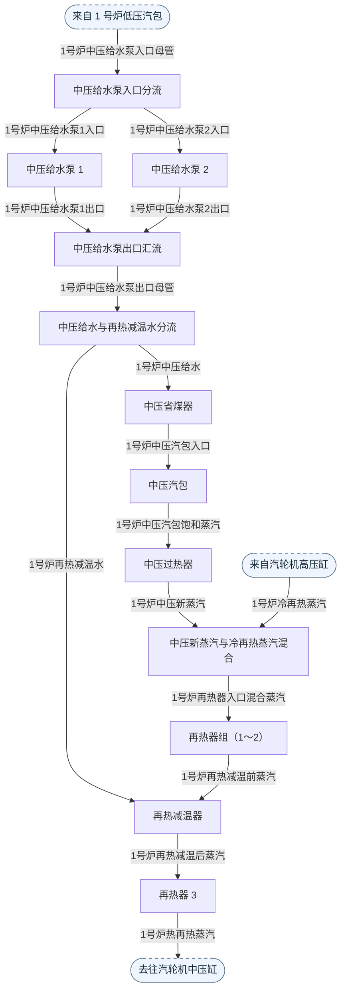

```mermaid
flowchart TB
    %% 设备与组合节点；组节点保留 1～2 级再热受热面的整体连接
    ip1_pump_split["中压给水泵入口分流"]
    ip1_pump1["中压给水泵 1"]
    ip1_pump2["中压给水泵 2"]
    ip1_pump_merge["中压给水泵出口汇流"]
    ip1_feed_split["中压给水与再热减温水分流"]
    ip1_economizer["中压省煤器"]
    ip1_drum_evaporator["中压汽包"]
    ip1_superheater["中压过热器"]
    ip1_fresh_steam_mix["中压新蒸汽与冷再热蒸汽混合"]
    ip1_reheater_group["再热器组（1～2）"]
    ip1_attemperator["再热减温器"]
    ip1_reheater3["再热器 3"]

    %% 外部接口；圆角节点表示本系统的入口和出口
    ip1_feedwater_in(["来自 1 号炉低压汽包"])
    ip1_cold_reheat_in(["来自汽轮机高压缸"])
    ip1_hot_reheat_out(["去往汽轮机中压缸"])

    %% 物质流连接；流股按设备位置和介质命名
    ip1_feedwater_in -->|1号炉中压给水泵入口母管| ip1_pump_split
    ip1_pump_split -->|1号炉中压给水泵1入口| ip1_pump1
    ip1_pump_split -->|1号炉中压给水泵2入口| ip1_pump2
    ip1_pump1 -->|1号炉中压给水泵1出口| ip1_pump_merge
    ip1_pump2 -->|1号炉中压给水泵2出口| ip1_pump_merge
    ip1_pump_merge -->|1号炉中压给水泵出口母管| ip1_feed_split
    ip1_feed_split -->|1号炉中压给水| ip1_economizer
    ip1_feed_split -->|1号炉再热减温水| ip1_attemperator
    ip1_economizer -->|1号炉中压汽包入口| ip1_drum_evaporator
    ip1_drum_evaporator -->|1号炉中压汽包饱和蒸汽| ip1_superheater
    ip1_superheater -->|1号炉中压新蒸汽| ip1_fresh_steam_mix
    ip1_cold_reheat_in -->|1号炉冷再热蒸汽| ip1_fresh_steam_mix
    ip1_fresh_steam_mix -->|1号炉再热器入口混合蒸汽| ip1_reheater_group
    ip1_reheater_group -->|1号炉再热减温前蒸汽| ip1_attemperator
    ip1_attemperator -->|1号炉再热减温后蒸汽| ip1_reheater3
    ip1_reheater3 -->|1号炉热再热蒸汽| ip1_hot_reheat_out

    classDef boundary fill:#eef5ff,stroke:#526d82,stroke-dasharray:5 5,color:#162b3b;
    class ip1_feedwater_in,ip1_cold_reheat_in,ip1_hot_reheat_out boundary;
```
