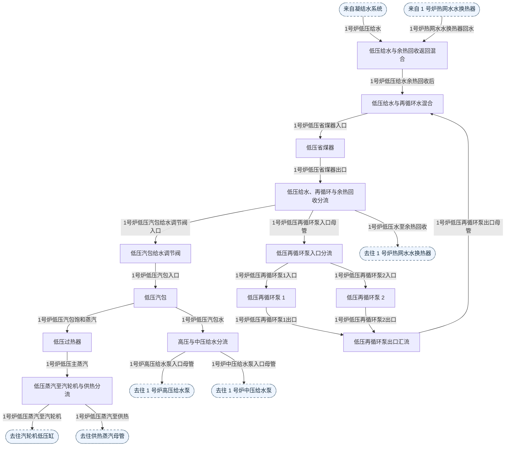

```mermaid
flowchart TB
    %% 设备节点；保留省煤器再循环、余热回收和汽包供水主路径
    lp1_heat_recovery_return["低压给水与余热回收返回混合"]
    lp1_recycle_mix["低压给水与再循环水混合"]
    lp1_economizer["低压省煤器"]
    lp1_recycle_split["低压给水、再循环与余热回收分流"]
    lp1_pump_split["低压再循环泵入口分流"]
    lp1_pump1["低压再循环泵 1"]
    lp1_pump2["低压再循环泵 2"]
    lp1_pump_merge["低压再循环泵出口汇流"]
    lp1_feedwater_valve["低压汽包给水调节阀"]
    lp1_drum_evaporator["低压汽包"]
    lp1_water_split["高压与中压给水分流"]
    lp1_superheater["低压过热器"]
    lp1_main_split["低压蒸汽至汽轮机与供热分流"]

    %% 外部接口；圆角节点表示本系统的入口和出口
    lp1_feedwater_in(["来自凝结水系统"])
    lp1_heat_recovery_water_in(["来自 1 号炉热网水水换热器"])
    lp1_heat_recovery_water_out(["去往 1 号炉热网水水换热器"])
    lp1_hp_feedwater_out(["去往 1 号炉高压给水泵"])
    lp1_ip_feedwater_out(["去往 1 号炉中压给水泵"])
    lp1_main_steam_out(["去往汽轮机低压缸"])
    lp1_heating_steam_out(["去往供热蒸汽母管"])

    %% 物质流连接；流股按设备位置和介质命名
    lp1_feedwater_in -->|1号炉低压给水| lp1_heat_recovery_return
    lp1_heat_recovery_water_in -->|1号炉热网水水换热器回水| lp1_heat_recovery_return
    lp1_heat_recovery_return -->|1号炉低压给水余热回收后| lp1_recycle_mix
    lp1_pump_merge -->|1号炉低压再循环泵出口母管| lp1_recycle_mix
    lp1_recycle_mix -->|1号炉低压省煤器入口| lp1_economizer
    lp1_economizer -->|1号炉低压省煤器出口| lp1_recycle_split
    lp1_recycle_split -->|1号炉低压汽包给水调节阀入口| lp1_feedwater_valve
    lp1_feedwater_valve -->|1号炉低压汽包入口| lp1_drum_evaporator
    lp1_recycle_split -->|1号炉低压再循环泵入口母管| lp1_pump_split
    lp1_recycle_split -->|1号炉低压水至余热回收| lp1_heat_recovery_water_out
    lp1_pump_split -->|1号炉低压再循环泵1入口| lp1_pump1
    lp1_pump_split -->|1号炉低压再循环泵2入口| lp1_pump2
    lp1_pump1 -->|1号炉低压再循环泵1出口| lp1_pump_merge
    lp1_pump2 -->|1号炉低压再循环泵2出口| lp1_pump_merge
    lp1_drum_evaporator -->|1号炉低压汽包饱和蒸汽| lp1_superheater
    lp1_drum_evaporator -->|1号炉低压汽包水| lp1_water_split
    lp1_water_split -->|1号炉高压给水泵入口母管| lp1_hp_feedwater_out
    lp1_water_split -->|1号炉中压给水泵入口母管| lp1_ip_feedwater_out
    lp1_superheater -->|1号炉低压主蒸汽| lp1_main_split
    lp1_main_split -->|1号炉低压蒸汽至汽轮机| lp1_main_steam_out
    lp1_main_split -->|1号炉低压蒸汽至供热| lp1_heating_steam_out

    classDef boundary fill:#eef5ff,stroke:#526d82,stroke-dasharray:5 5,color:#162b3b;
    class lp1_feedwater_in,lp1_heat_recovery_water_in,lp1_heat_recovery_water_out,lp1_hp_feedwater_out,lp1_ip_feedwater_out,lp1_main_steam_out,lp1_heating_steam_out boundary;
```
