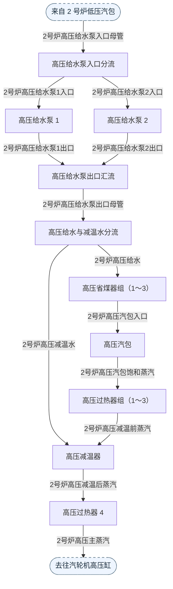

```mermaid
flowchart TB
    %% 设备与组合节点；组节点保留 1～3 级受热面的整体连接
    hp2_pump_split["高压给水泵入口分流"]
    hp2_pump1["高压给水泵 1"]
    hp2_pump2["高压给水泵 2"]
    hp2_pump_merge["高压给水泵出口汇流"]
    hp2_feed_split["高压给水与减温水分流"]
    hp2_economizer_group["高压省煤器组（1～3）"]
    hp2_drum_evaporator["高压汽包"]
    hp2_superheater_group["高压过热器组（1～3）"]
    hp2_attemperator["高压减温器"]
    hp2_superheater4["高压过热器 4"]

    %% 外部接口；圆角节点表示本系统的入口和出口
    hp2_feedwater_in(["来自 2 号炉低压汽包"])
    hp2_main_steam_out(["去往汽轮机高压缸"])

    %% 物质流连接；流股按设备位置和介质命名
    hp2_feedwater_in -->|2号炉高压给水泵入口母管| hp2_pump_split
    hp2_pump_split -->|2号炉高压给水泵1入口| hp2_pump1
    hp2_pump_split -->|2号炉高压给水泵2入口| hp2_pump2
    hp2_pump1 -->|2号炉高压给水泵1出口| hp2_pump_merge
    hp2_pump2 -->|2号炉高压给水泵2出口| hp2_pump_merge
    hp2_pump_merge -->|2号炉高压给水泵出口母管| hp2_feed_split
    hp2_feed_split -->|2号炉高压给水| hp2_economizer_group
    hp2_feed_split -->|2号炉高压减温水| hp2_attemperator
    hp2_economizer_group -->|2号炉高压汽包入口| hp2_drum_evaporator
    hp2_drum_evaporator -->|2号炉高压汽包饱和蒸汽| hp2_superheater_group
    hp2_superheater_group -->|2号炉高压减温前蒸汽| hp2_attemperator
    hp2_attemperator -->|2号炉高压减温后蒸汽| hp2_superheater4
    hp2_superheater4 -->|2号炉高压主蒸汽| hp2_main_steam_out

    classDef boundary fill:#eef5ff,stroke:#526d82,stroke-dasharray:5 5,color:#162b3b;
    class hp2_feedwater_in,hp2_main_steam_out boundary;
```
