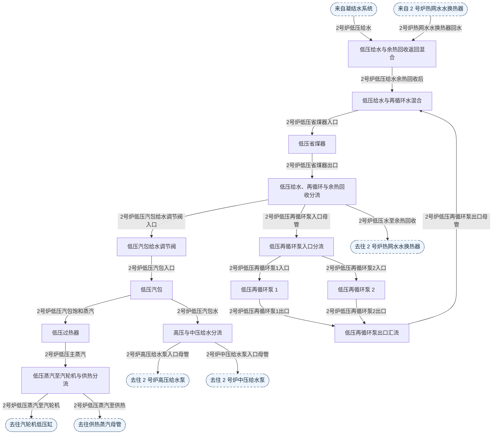

```mermaid
flowchart TB
    %% 设备节点；保留省煤器再循环、余热回收和汽包供水主路径
    lp2_heat_recovery_return["低压给水与余热回收返回混合"]
    lp2_recycle_mix["低压给水与再循环水混合"]
    lp2_economizer["低压省煤器"]
    lp2_recycle_split["低压给水、再循环与余热回收分流"]
    lp2_pump_split["低压再循环泵入口分流"]
    lp2_pump1["低压再循环泵 1"]
    lp2_pump2["低压再循环泵 2"]
    lp2_pump_merge["低压再循环泵出口汇流"]
    lp2_feedwater_valve["低压汽包给水调节阀"]
    lp2_drum_evaporator["低压汽包"]
    lp2_water_split["高压与中压给水分流"]
    lp2_superheater["低压过热器"]
    lp2_main_split["低压蒸汽至汽轮机与供热分流"]

    %% 外部接口；圆角节点表示本系统的入口和出口
    lp2_feedwater_in(["来自凝结水系统"])
    lp2_heat_recovery_water_in(["来自 2 号炉热网水水换热器"])
    lp2_heat_recovery_water_out(["去往 2 号炉热网水水换热器"])
    lp2_hp_feedwater_out(["去往 2 号炉高压给水泵"])
    lp2_ip_feedwater_out(["去往 2 号炉中压给水泵"])
    lp2_main_steam_out(["去往汽轮机低压缸"])
    lp2_heating_steam_out(["去往供热蒸汽母管"])

    %% 物质流连接；流股按设备位置和介质命名
    lp2_feedwater_in -->|2号炉低压给水| lp2_heat_recovery_return
    lp2_heat_recovery_water_in -->|2号炉热网水水换热器回水| lp2_heat_recovery_return
    lp2_heat_recovery_return -->|2号炉低压给水余热回收后| lp2_recycle_mix
    lp2_pump_merge -->|2号炉低压再循环泵出口母管| lp2_recycle_mix
    lp2_recycle_mix -->|2号炉低压省煤器入口| lp2_economizer
    lp2_economizer -->|2号炉低压省煤器出口| lp2_recycle_split
    lp2_recycle_split -->|2号炉低压汽包给水调节阀入口| lp2_feedwater_valve
    lp2_feedwater_valve -->|2号炉低压汽包入口| lp2_drum_evaporator
    lp2_recycle_split -->|2号炉低压再循环泵入口母管| lp2_pump_split
    lp2_recycle_split -->|2号炉低压水至余热回收| lp2_heat_recovery_water_out
    lp2_pump_split -->|2号炉低压再循环泵1入口| lp2_pump1
    lp2_pump_split -->|2号炉低压再循环泵2入口| lp2_pump2
    lp2_pump1 -->|2号炉低压再循环泵1出口| lp2_pump_merge
    lp2_pump2 -->|2号炉低压再循环泵2出口| lp2_pump_merge
    lp2_drum_evaporator -->|2号炉低压汽包饱和蒸汽| lp2_superheater
    lp2_drum_evaporator -->|2号炉低压汽包水| lp2_water_split
    lp2_water_split -->|2号炉高压给水泵入口母管| lp2_hp_feedwater_out
    lp2_water_split -->|2号炉中压给水泵入口母管| lp2_ip_feedwater_out
    lp2_superheater -->|2号炉低压主蒸汽| lp2_main_split
    lp2_main_split -->|2号炉低压蒸汽至汽轮机| lp2_main_steam_out
    lp2_main_split -->|2号炉低压蒸汽至供热| lp2_heating_steam_out

    classDef boundary fill:#eef5ff,stroke:#526d82,stroke-dasharray:5 5,color:#162b3b;
    class lp2_feedwater_in,lp2_heat_recovery_water_in,lp2_heat_recovery_water_out,lp2_hp_feedwater_out,lp2_ip_feedwater_out,lp2_main_steam_out,lp2_heating_steam_out boundary;
```
