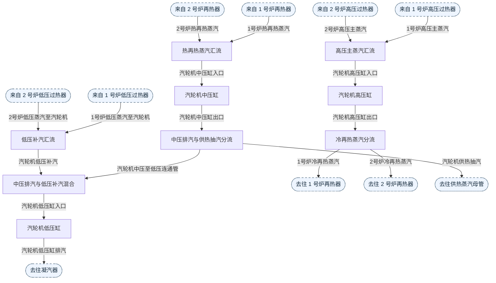

```mermaid
flowchart TB
    %% 设备节点；保留高压缸、再热接口、供热抽汽和低压补汽主路径
    hp_main_merge["高压主蒸汽汇流"]
    hp_turbine["汽轮机高压缸"]
    cold_reheat_split["冷再热蒸汽分流"]
    hot_reheat_merge["热再热蒸汽汇流"]
    ip_turbine["汽轮机中压缸"]
    ip_exhaust_split["中压排汽与供热抽汽分流"]
    lp_admission_merge["低压补汽汇流"]
    lp_inlet_mix["中压排汽与低压补汽混合"]
    lp_turbine["汽轮机低压缸"]

    %% 外部接口；圆角节点表示本系统的入口和出口
    st_hp_steam1_in(["来自 1 号炉高压过热器"])
    st_hp_steam2_in(["来自 2 号炉高压过热器"])
    st_cold_reheat1_out(["去往 1 号炉再热器"])
    st_cold_reheat2_out(["去往 2 号炉再热器"])
    st_hot_reheat1_in(["来自 1 号炉再热器"])
    st_hot_reheat2_in(["来自 2 号炉再热器"])
    st_lp_steam1_in(["来自 1 号炉低压过热器"])
    st_lp_steam2_in(["来自 2 号炉低压过热器"])
    st_heating_steam_out(["去往供热蒸汽母管"])
    st_exhaust_out(["去往凝汽器"])

    %% 物质流连接；流股按设备位置和介质命名
    st_hp_steam1_in -->|1号炉高压主蒸汽| hp_main_merge
    st_hp_steam2_in -->|2号炉高压主蒸汽| hp_main_merge
    hp_main_merge -->|汽轮机高压缸入口| hp_turbine
    hp_turbine -->|汽轮机高压缸出口| cold_reheat_split
    cold_reheat_split -->|1号炉冷再热蒸汽| st_cold_reheat1_out
    cold_reheat_split -->|2号炉冷再热蒸汽| st_cold_reheat2_out
    st_hot_reheat1_in -->|1号炉热再热蒸汽| hot_reheat_merge
    st_hot_reheat2_in -->|2号炉热再热蒸汽| hot_reheat_merge
    hot_reheat_merge -->|汽轮机中压缸入口| ip_turbine
    ip_turbine -->|汽轮机中压缸出口| ip_exhaust_split
    ip_exhaust_split -->|汽轮机中压至低压连通管| lp_inlet_mix
    ip_exhaust_split -->|汽轮机供热抽汽| st_heating_steam_out
    st_lp_steam1_in -->|1号炉低压蒸汽至汽轮机| lp_admission_merge
    st_lp_steam2_in -->|2号炉低压蒸汽至汽轮机| lp_admission_merge
    lp_admission_merge -->|汽轮机低压补汽| lp_inlet_mix
    lp_inlet_mix -->|汽轮机低压缸入口| lp_turbine
    lp_turbine -->|汽轮机低压缸排汽| st_exhaust_out

    classDef boundary fill:#eef5ff,stroke:#526d82,stroke-dasharray:5 5,color:#162b3b;
    class st_hp_steam1_in,st_hp_steam2_in,st_cold_reheat1_out,st_cold_reheat2_out,st_hot_reheat1_in,st_hot_reheat2_in,st_lp_steam1_in,st_lp_steam2_in,st_heating_steam_out,st_exhaust_out boundary;
```
